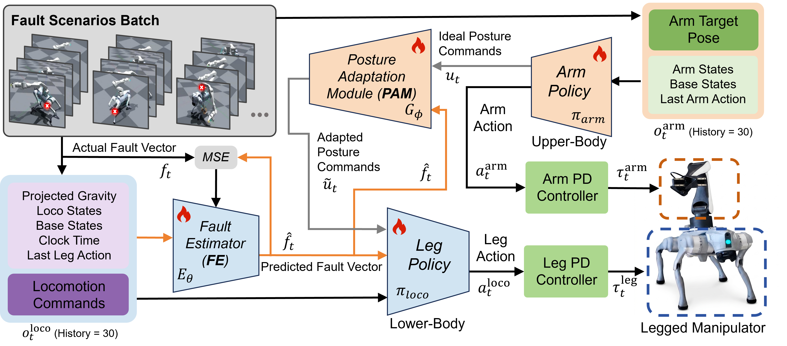

# FT-WBC: Learning Fault-Tolerant Whole-Body Control for Legged Loco-Manipulation

This repository hosts the official implementation and project materials for **FT-WBC: Learning Fault-Tolerant Whole-Body Control for Legged Loco-Manipulation**.

FT-WBC is a fault-tolerant whole-body control framework for legged loco-manipulation under actuator failures. The goal is to improve the robustness of legged manipulators when lower-limb actuator faults occur, enabling stable locomotion and manipulation through fault-aware policy adaptation.

## Overview

Legged manipulators combine quadruped mobility with robotic arm manipulation. However, actuator failures can severely affect balance, reachable workspace, and task success.

FT-WBC introduces a fault-tolerant loco-manipulation framework that estimates actuator faults and adapts whole-body posture commands to maintain stable behavior under failure conditions.

## Framework

## Code

Code is coming soon.

## Citation

If you find this work useful, please consider citing our paper. Citation information will be updated soon.

## Contact

For questions or discussions, please open an issue in this repository.
